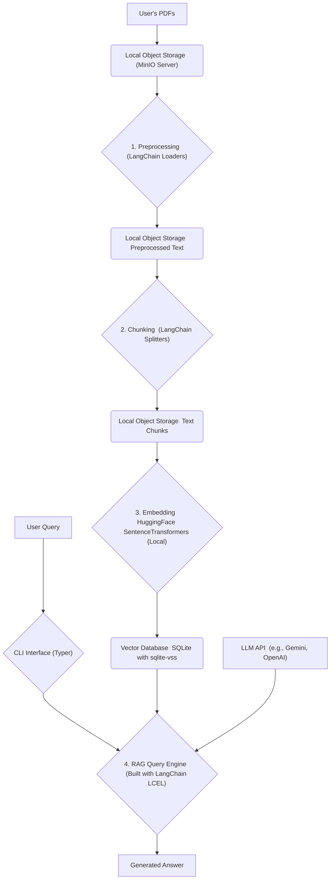
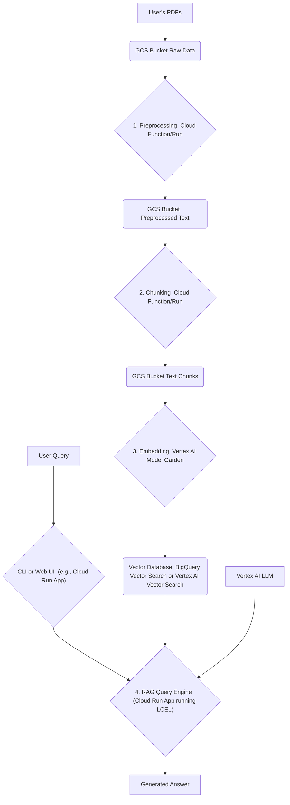

# Project: TextNexus - Auto-RAG Pipeline Builder

This document outlines the architecture, requirements, and development plan for the TextNexus project. The goal is to create a modular and scalable Python application that automatically builds and deploys Retrieval-Augmented Generation (RAG) pipelines for querying PDF documents.

This context is intended to guide development efforts, particularly when collaborating with AI assistants like GitHub Copilot.

## 1. High-Level Requirements

The system must meet the following criteria:

* **Data Ingestion:** Ingest single or multiple PDF files as the source for the knowledge base.

* **Local Emulation:** All storage components (object storage, databases) must be emulatable on a local machine for development and testing.

* **Cloud Readiness:** The architecture must be designed for straightforward deployment to Google Cloud Platform (GCP).

* **Modular Pipeline:** The RAG process (ingestion, chunking, embedding, storage, querying) must be broken into distinct, modular components.

* **Extensibility:** The initial API-based RAG pipeline (v1.0) must be easily extensible to a more complex, agentic architecture (v2.0).

* **Observability:** The application must be traceable and debuggable from the start to understand the flow of data and LLM calls.

* **User Interface:** Provide a Command Line Interface (CLI) for users to interact with the system.

## 2. System Architecture

The architecture is designed in two phases: local development and future GCP deployment. The core RAG logic will be built using the **LangChain** framework and monitored with **LangSmith**.

### 2.1. Local Development Architecture (Version 1.0)

This setup prioritizes ease of use and rapid iteration on a local machine.



### 2.2. Target GCP Architecture (Future Version)

This architecture replaces local components with scalable, managed GCP services.



## 3. Development Best Practices

* **Version Control:** Use Git with a structured branching strategy (e.g., GitFlow). Commit messages must follow the **Conventional Commits** specification.

* **Dependency Management:** Use **Poetry** to manage Python dependencies and virtual environments.

* **Logging & Observability:** Implement standard `logging` and integrate with **LangSmith** from day one for tracing and debugging LLM calls.

* **Documentation:** All functions and classes must have up-to-date docstrings following the **Google Python Style Guide**.

* **Testing:** Employ Test-Driven Development (TDD) where practical. Use `pytest` for unit and integration tests.

* **Project Management:** Track user stories, features, and tasks using **GitHub Projects**.

* **IaC:** Infrastructure as Code will be managed with **Terraform**, using JSON configuration files.

## 4. Proposed Code Structure (v1.0 -> v2.0)

The project will be organized into a modular structure. The `pipelines/` directory will contain the main LCEL (LangChain Expression Language) chains.

```
TextNexus/
├── AGENTS.MD               # Instructions for AI agents
├── LICENSE                 # Project License (MIT)
├── pyproject.toml        # Poetry dependencies and project metadata
├── poetry.lock
├── auto_rag/
│   ├── __init__.py
│   ├── core/               # Core components (often wrapped for LangChain)
│   │   ├── __init__.py
│   │   ├── ingestion.py    # Document loading logic
│   │   ├── chunking.py     # Custom chunking strategies
│   │   ├── embedding.py    # Embedding model abstraction
│   │   ├── storage.py      # Vector DB abstraction
│   │   └── query.py        # Prompt templates and output parsers
│   │
│   ├── pipelines/          # Wires components into runnable LCEL chains
│   │   ├── __init__.py
│   │   └── standard_rag.py # The main RAG chain for v1.0
│   │
│   ├── agents/             # Placeholder for v2.0 (using LangGraph)
│   │   ├── __init__.py
│   │
│   ├── config.py           # Manages configuration (API keys, paths)
│   └── cli.py              # CLI definition using Typer
│
├── tests/                  # Pytest test suite
│   ├── core/
│   └── pipelines/
│
├── scripts/                # Helper scripts
│   └── start_minio.sh
│
├── docs/
│   └── PROJECT_PLAN.md     # This file
│
├── terraform/              # Terraform configurations for GCP
│   ├── project.tf.json     # GCP project setup, APIs
│   └── storage.tf.json     # GCS buckets
│
├── .gitignore
└── README.md
```

## 5. Technology Stack & Recommendations

* **LLM Application Framework:**

  * **LangChain (Modern Stack):** Use `langchain-core` for stability and **LangChain Expression Language (LCEL)** to compose the RAG pipeline.

  * **LangSmith (Observability):** Instrument the application with LangSmith from the very beginning for debugging and tracing.

  * **LangGraph (for v2.0):** For the future agentic version, use **LangGraph** to build agents as state machines.

* **Local Development Environment:**

  * **GPU Acceleration:** For optimal performance, enable a local CUDA-compatible NVIDIA GPU by installing the latest proprietary drivers for your operating system. This significantly speeds up the local embedding generation process.

* **Local Object Storage:** **MinIO**.

* **Local Vector DB:** **SQLite** with a vector search extension like `sqlite-vss`.

* **Cloud Vector DB:** **BigQuery Vector Search** or **Vertex AI Vector Search**.

* **Embedding Strategy Recommendation:**

  1. **Design with Extensibility:** Start with an abstract base class, `BaseEmbeddingModel`.

  2. **Initial Implementation (Local Model):** Implement a `SentenceTransformerModel` class using a local model from Hugging Face (e.g., `all-MiniLM-L6-v2`).

* **Chunking Strategy Recommendation:**

  1. **Design with Extensibility:** Start with an abstract base class, `BaseTextSplitter`.

  2. **Initial Implementation (`RecursiveCharacterTextSplitter`):** Use LangChain's built-in `RecursiveCharacterTextSplitter`.

* **CLI Framework:** **Typer**.